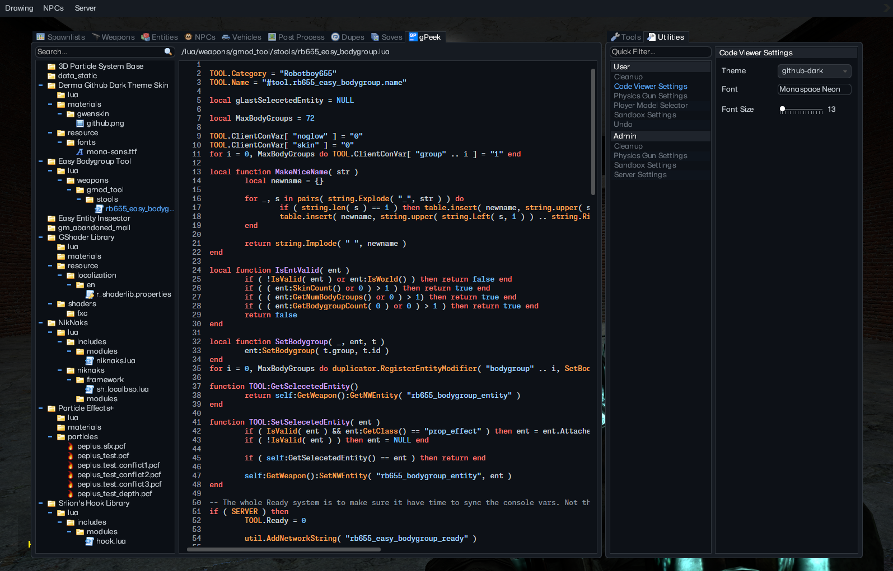
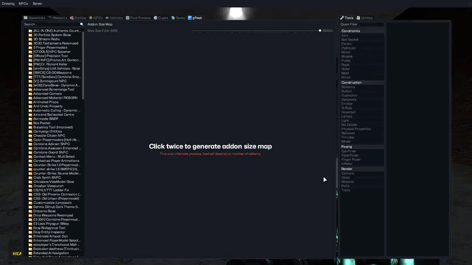
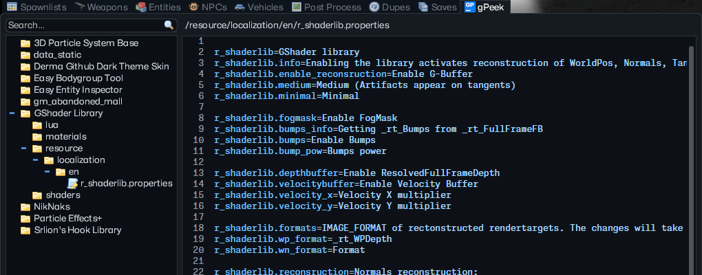
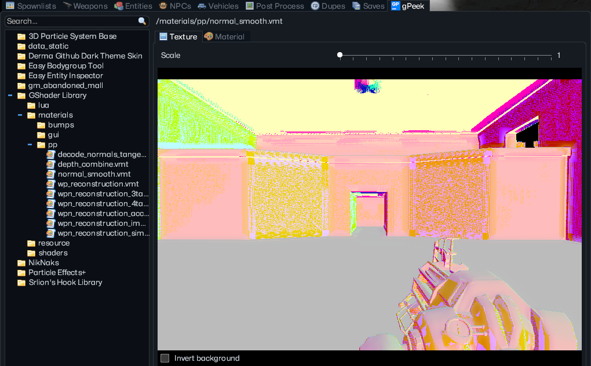
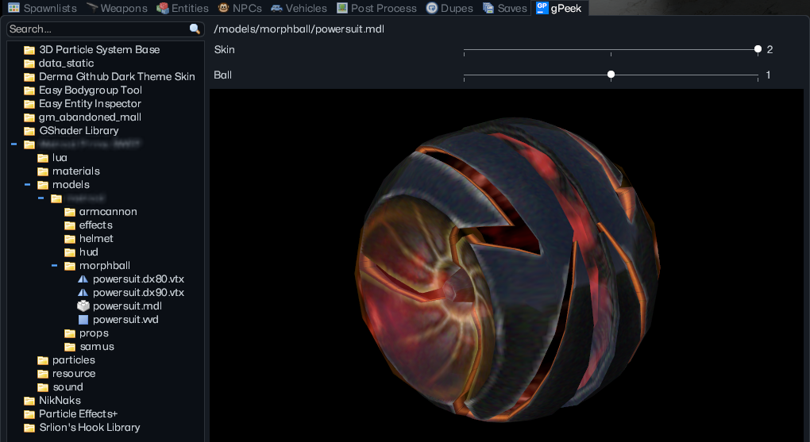
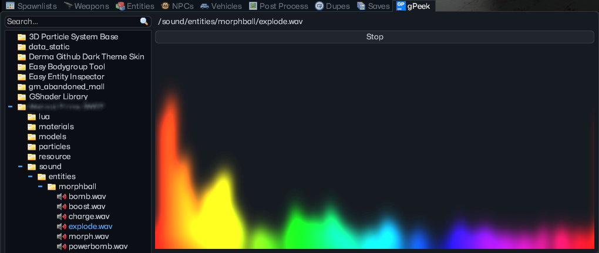
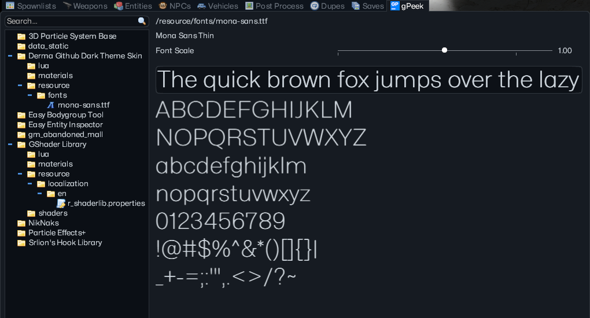
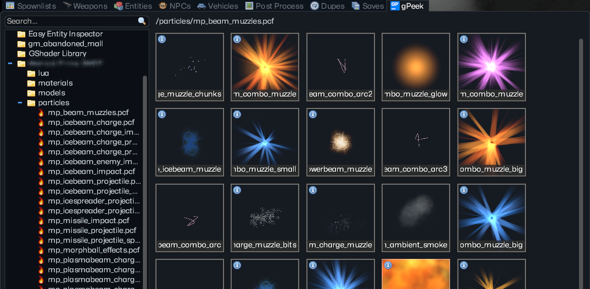

<h1 style="display: flex; align-items: center; gap: 10px;">
  
  gPeek
</h1>

*Browsing the inner machinations*

A modular Garry’s Mod addon inspection and file browsing framework built around a plugin-based UI system. gPeek provides a unified interface for browsing installed addons, inspecting files, and rendering content through extensible viewers (code, models, fonts, materials, audio, and particles).

[Get it on the Steam Workshop](https://steamcommunity.com/sharedfiles/filedetails/?id=3705662940)

<div>
  
  <sup><a href="https://github.com/JWalkerMailly/Derma-Github-Theme"><em>Derma-Github-Theme</em></a></sup>
</div>

> [!NOTE]
> The code viewer can be found here: [DCodeViewer](https://github.com/JWalkerMailly/DCodeViewer)

> [!NOTE]
> Artificial intelligence (AI), specifically Claude, was used to translate the “properties” file into 31 other languages supported by GMod.

<br>

## ⬇️ How to Install

It is recommended to use the [Workshop](https://steamcommunity.com/sharedfiles/filedetails/?id=3705662940) release.\
If you wish to clone the repository instead, you also need [DCodeViewer](https://github.com/JWalkerMailly/DCodeViewer) and [DAddonMap](https://github.com/JWalkerMailly/DAddonMap).

<br>

## ⚙️ Core Concepts

### Extension System

Each supported file type is handled by an extension module located in:

```
vgui/daddonbrowser/
```

Extensions define how files are:
- Initialized in UI
- Browsed/rendered
- Context-menu interacted with
- Invalidated/cleaned up

### Singleton UI Model

Extensions operate on a **singleton container instance**:

- Each extension type maintains one active UI container
- Switching files reuses the same UI instance
- Reduces memory overhead and avoids panel recreation

### Addon File Tree

The left panel provides a hierarchical view of installed addons:

Features:
- Lazy expansion
- On-demand file scanning
- Automatic cleanup on collapse

### Async File Traversal

The system uses coroutine-based batching to prevent frame spikes:

- File scanning is chunked (`gpeek_batch_size`)
- Timer-based resumption (`gpeek_batch_delay`)
- Cancellation tokens stop work on collapse

### ConVars

| Name | Description |
|------|------------|
| gpeek_batch_size | Number of files processed per coroutine batch |
| gpeek_batch_delay | Delay between async batches |
| gpeek_multi_addon | Allow expanding multiple addons |

### Addon Size Map

Offers a centralized way to inspect which addons are eating up the most space.

<div>
  <br>
  <sup><a href="https://github.com/JWalkerMailly/Derma-Github-Theme"><em>Derma-Github-Theme</em></a></sup>
</div>

> [!NOTE]
> The addon map can be found here: [DAddonMap](https://github.com/JWalkerMailly/DAddonMap)

<br>

## 🧩 Extension Types

Built-in or supported viewers. Extensions are stateless definitions, but runtime UIs are singleton-bound instances.

| Type | Description |
|------|------------|
| Code Viewer | Syntax-highlighted file display |
| Model Viewer | 3D model preview with animation/bodygroup/skin controls |
| Font Viewer | RenderTarget-based font preview system |
| Material Viewer | Texture/material inspection with preview |
| Audio Viewer | FFT spectrum visualizer with real-time rendering |
| Particle Viewer | PCF grid browser (requires PEPlus) |

### 📄 Text & Code Formats

| Extension | Viewer | Description |
|----------|--------|-------------|
| `.lua` | Code Viewer | Syntax-highlighted Lua source inspection |
| `.json` | Code Viewer | Structured JSON viewer with formatting |
| `.txt` | Code Viewer | Plain text viewer |
| `.properties` | Code Viewer | Key/value configuration inspection |
| `.csv` | Code Viewer | Tabular data display (raw format view) |

<div>
  
  <sup><a href="https://github.com/JWalkerMailly/Derma-Github-Theme"><em>Derma-Github-Theme</em></a></sup>
</div>

> [!NOTE]
> The code viewer can be found here: [DCodeViewer](https://github.com/JWalkerMailly/DCodeViewer)

### 🎨 Image & Texture Formats

| Extension | Viewer | Description |
|----------|--------|-------------|
| `.png` | Material Viewer | Texture preview with scaling |
| `.jpg` / `.jpeg` | Material Viewer | Image preview renderer |
| `.vmt` | Material Viewer | Valve Material Type inspector + source view |

<div>
  
  <sup><a href="https://github.com/JWalkerMailly/Derma-Github-Theme"><em>Derma-Github-Theme</em></a></sup>
</div>

### 🎮 Model Format

| Extension | Viewer | Description |
|----------|--------|-------------|
| `.mdl` | Model Viewer | 3D model preview with animation, skin and bodygroup controls |

<div>
  
  <sup><a href="https://github.com/JWalkerMailly/Derma-Github-Theme"><em>Derma-Github-Theme</em></a></sup>
</div>

### 🔊 Audio Formats

| Extension | Viewer | Description |
|----------|--------|-------------|
| `.mp3` | Audio Visualizer | FFT spectrum visualizer with real-time rendering |
| `.ogg` | Audio Visualizer | Audio playback + spectrum analysis |
| `.wav` | Audio Visualizer | Audio playback + spectrum rendering |

<div>
  
  <sup><a href="https://github.com/JWalkerMailly/Derma-Github-Theme"><em>Derma-Github-Theme</em></a></sup>
</div>

### 🔤 Font Format

| Extension | Viewer | Description |
|----------|--------|-------------|
| `.ttf` | Font Viewer | RenderTarget-based font preview system |

<div>
  
  <sup><a href="https://github.com/JWalkerMailly/Derma-Github-Theme"><em>Derma-Github-Theme</em></a></sup>
</div>

### 💥 Particle Format

| Extension | Viewer | Description |
|----------|--------|-------------|
| `.pcf` | Particle Browser | Particle system inspector (requires [Particle Effects+](https://steamcommunity.com/sharedfiles/filedetails/?id=3684885115)) |

<div>
  
  <sup><a href="https://github.com/JWalkerMailly/Derma-Github-Theme"><em>Derma-Github-Theme</em></a></sup>
</div>

<br>

## 🚀 Optimizations

### Coroutine Batch Processing
Large directory trees are processed using:

- Batch size limiting (`gpeek_batch_size`)
- Yield-based iteration
- Timer resumption loops

### Cancellation Tokens
Folder nodes track cancellation state:

- Prevents wasted async work
- Stops traversal when collapsed
- Ensures no orphan UI builds

### Memory Management

- UI panels are explicitly removed on replacement
- Folder collapse destroys children nodes
- Extension containers are reused but reset via lifecycle hooks

<br>

## ✏️ Architecture

gPeek is built around:

- Modular extension-based architecture
- Lazy execution (build only when needed)
- Low frame impact via async batching
- State reuse via singleton extension containers
- Runtime dependency resolution

<br>

## 📦 Dependencies

- [DCodeViewer](https://github.com/JWalkerMailly/DCodeViewer)
- [DAddonMap](https://github.com/JWalkerMailly/DAddonMap)
- [Particle Effects+](https://github.com/NO-LOAFING/ParticleEffectsPlus) - Optional, opt-in only

<br>

## 📖 Summary

gPeek is a plugin-based addon inspection framework for Garry’s Mod. It functions as a developer toolbox for inspecting the game’s addon ecosystem in real time. This project was mainly made for fun in my spare time, contributions are always welcome.
